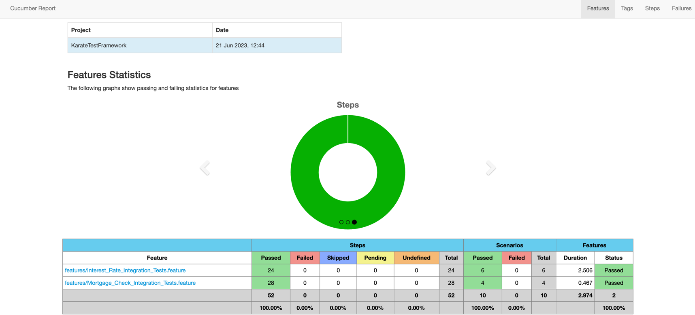

# ING-Mortgage-NL

```
cd existing_repo
git remote add origin https://gitlab.com/debashish.c/ing-mortgage-nl.git
git branch -M main
git push -uf origin main
```

**ING Mortgage NL Description**


**Test Report: ING Mortgage NL**




